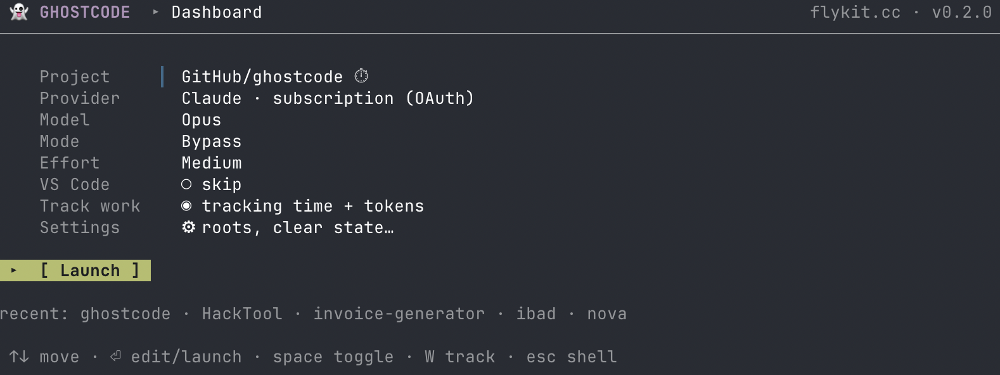
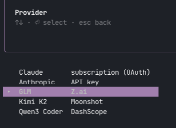
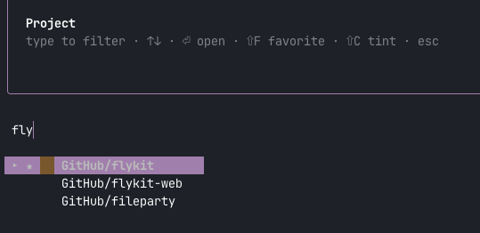

# GhostCode

> **For everyone who loves Claude Code and wishes it remembered their setup.**
> Swap models on a whim, tint your projects so Monday-you remembers what Friday-you was doing, and spin up ten pre-configured terminals in a row — without re-picking anything. Hit Enter twice. Work starts.

A Ghostty launcher for Claude Code. Part of [flykit.cc](https://flykit.cc).



## Use Claude Code with any LLM

Claude Code is a powerful agentic coding engine — but it doesn't have to run on Claude. GhostCode makes it trivial to point it at any OpenAI-compatible endpoint: open-weight models, self-hosted inference, or commercial APIs that speak the Anthropic protocol. Switch providers per-project, and your keys stay in the macOS Keychain — never in a config file, never in an env var you forget to unset.

Built-in providers out of the box:

| Provider | API |
|---|---|
| Claude | subscription (OAuth) — no key needed |
| Anthropic | API key — pay-per-token |
| GLM (Z.ai) | API key — GLM-5.1 and family |
| Kimi K2 | API key — Moonshot |
| Qwen3 Coder | API key — DashScope |

Add your own in `~/.config/ghostcode/providers.json` — any OpenAI-compatible endpoint works.

## Features

- **Fuzzy project picker** — type a few chars, starred favorites pinned on top, auto-tracked recents below
- **Per-project tints** — press `⇧C` to cycle a color; it follows the project into CC's statusline too
- **Model, effort, mode, provider** — all visible on the Dashboard, saved per-project and globally
- **Any LLM as a backend** — GLM, Kimi, Qwen, self-hosted, or any OpenAI-compatible endpoint; keys in Keychain
- **First-run wizard** — installs Ghostty if missing, wires Ghostty config, wires the CC statusline. Aborts cleanly if you skip.
- **`claude update` on every launch** — always ships you the latest



## Requirements

- **macOS**
- **Homebrew** — [brew.sh](https://brew.sh)

Everything else (Ghostty, Claude Code) is installed by the first-run wizard.

## Install

```bash
npm install -g @flykit/ghostcode
```

Then open Ghostty. The first-run wizard launches automatically and wires Ghostty to run GhostCode on every new window. On subsequent launches, you go straight to the picker.



## Health check

```bash
ghostcode --version
```

Detailed status of every dep and config point:

```bash
# Included in the npm package
$(npm root -g)/@flykit/ghostcode/scripts/doctor.sh
```

## What GhostCode modifies on your system

| Location | When | Reversible? |
|---|---|---|
| `~/.config/ghostcode/` | Always — state, config, setup marker | `rm -rf ~/.config/ghostcode` |
| Ghostty config | During setup — appends a `command = ghostcode` line | Remove the line manually |
| `~/.claude/settings.json` | During setup — sets `statusLine` | Delete the `statusLine` key |
| macOS Keychain (items under account `ghostcode`) | When you store non-OAuth provider API keys | Keychain Access → delete entries |

No telemetry. No network calls beyond `claude update`, `brew`, and `npm` — all gated behind wizard prompts. State is local-only.

## Uninstall

```bash
npm uninstall -g @flykit/ghostcode
rm -rf ~/.config/ghostcode
# Remove the `command = ghostcode` line from your Ghostty config
# Remove the `statusLine` key from ~/.claude/settings.json if added
```

## Disclaimers

- **Not affiliated** with Anthropic (Claude, Claude Code) or Mitchell Hashimoto (Ghostty). *Claude*, *Claude Code*, *Anthropic*, and *Ghostty* are trademarks of their respective owners. GhostCode is an independent integration built for interoperability.
- **Licensed MIT** — see [LICENSE](LICENSE). Use at your own risk. No warranty.
- **Interactive system changes** — the setup wizard runs `brew install`, `npm install -g`, and writes to the config files listed above. Review `scripts/init.sh` before running if that's a concern.
- **API keys** for non-OAuth providers are stored in macOS Keychain under account `ghostcode`. Never committed, never logged.

## License

MIT. See [LICENSE](LICENSE).
